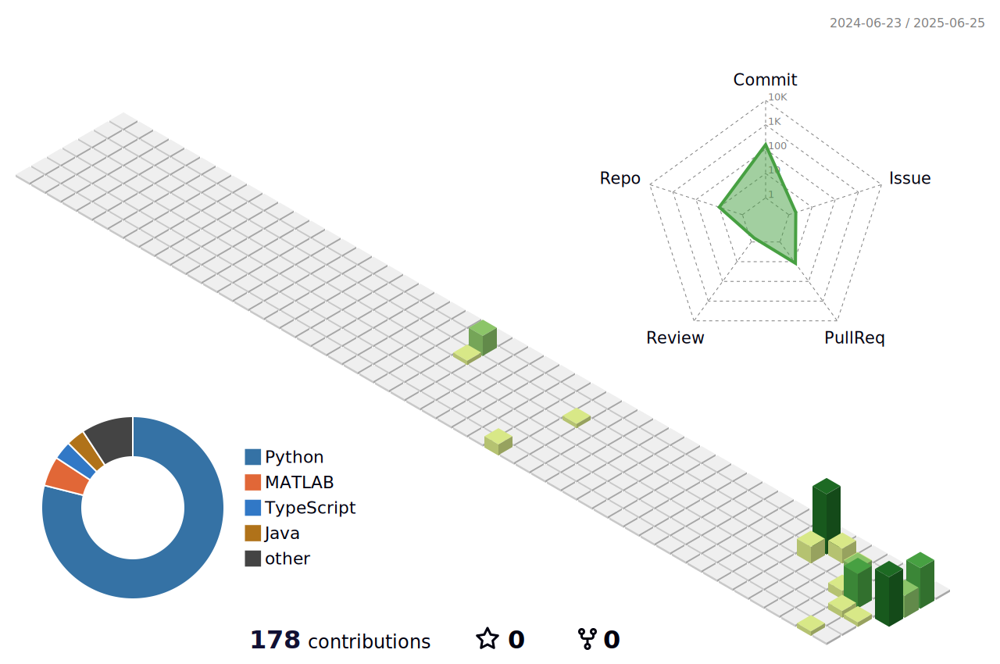

# Hi there! 👋

I'm Jeremy, a passionate developer who loves creating amazing projects.

## 📊 3D GitHub Contribution Graph

*This 3D contribution graph shows my GitHub activity in a beautiful 3D visualization. It's automatically updated weekly via GitHub Actions.*

### Available 3D Graph Styles

- **Green Animated** (`profile-green-animate.svg`) - Classic GitHub green with animation
- **Green Static** (`profile-green.svg`) - Classic GitHub green without animation  
- **Season Animated** (`profile-season-animate.svg`) - Seasonal colors with animation
- **Season Static** (`profile-season.svg`) - Seasonal colors without animation
- **Night View** (`profile-night-view.svg`) - Dark theme visualization
- **Night Green** (`profile-night-green.svg`) - Dark theme with green accents
- **Night Rainbow** (`profile-night-rainbow.svg`) - Dark theme with rainbow colors
- **Git Block** (`profile-gitblock.svg`) - Block-style visualization

## 🚀 About Me

Welcome to my GitHub profile! Here you'll find my latest projects and contributions.

## 📈 GitHub Stats

<!-- Add more sections as needed -->

---

🔧 About this 3D Contribution Graph

This 3D contribution graph is generated using [github-profile-3d-contrib](https://github.com/yoshi389111/github-profile-3d-contrib) by yoshi389111.

### Manual Update

To manually update the graph:

1. Get a GitHub Personal Access Token from [GitHub Settings](https://github.com/settings/tokens)
2. Set the environment variable: `export GITHUB_TOKEN=your_token_here`
3. Run: `./generate-3d-graph.sh`

### Automatic Updates

The graph is automatically updated every Sunday via GitHub Actions. The workflow:
- Fetches the latest contribution data
- Generates multiple 3D visualization styles
- Commits the updated images to the repository

Jeremy, a passionate developer who loves creating amazing projects.

## GitHub Contribution Graph

##  About Me

Welcome to my GitHub profile! Here you'll find my latest projects and contributions.

##  GitHub Stats

<!-- Add more sections as needed -->

---

*This 3D contribution graph is automatically updated weekly via GitHub Actions.*
